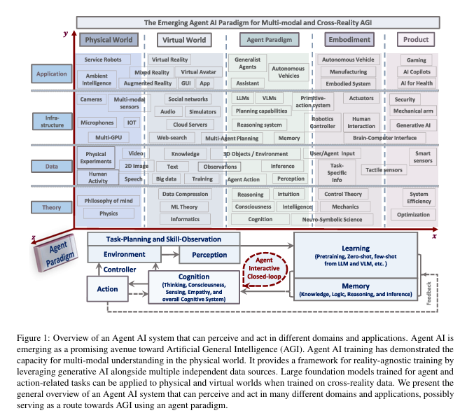

**Key Points from [arXiv:2401.03568](https://arxiv.org/pdf/2401.03568):**
AGENT AI: SURVEYING THE HORIZONS OF MULTIMODAL INTERACTION
 Zane Durante1†*, Qiuyuan Huang2‡∗, Naoki Wake2∗,
 Ran Gong3†, Jae Sung Park4†, Bidipta Sarkar1†, Rohan Taori1†, Yusuke Noda5,
 Demetri Terzopoulos3, Yejin Choi4, Katsushi Ikeuchi2, Hoi Vo5, Li Fei-Fei1, Jianfeng Gao2
 arXiv:2401.03568v2  [cs.AI]  25 Jan 2024
 1Stanford University; 2Microsoft Research, Redmond;
 3University of California, Los Angeles; 4University of Washington; 5Microsoft Gaming

- Introduces AgentAI, a framework for building autonomous AI agents capable of complex reasoning and decision-making.
- Emphasizes modularity, allowing integration of various models and tools for perception, planning, and action.
- Demonstrates AgentAI's effectiveness on diverse tasks, including web navigation and multi-step problem solving.
- Highlights the use of memory and tool-use to enhance agent capabilities.
- Presents experimental results showing improved performance over baseline approaches.
- Discusses future directions for scaling and generalizing agent architectures.

For more details, see the full paper: [https://arxiv.org/pdf/2401.03568](https://arxiv.org/pdf/2401.03568)